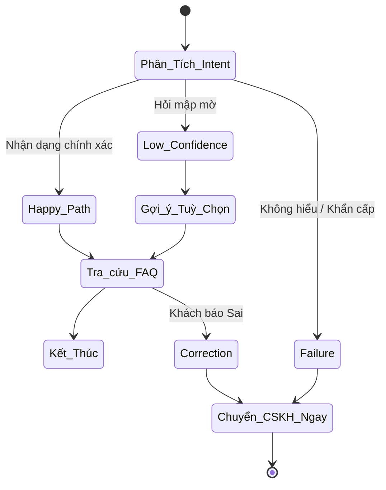

# BÁO CÁO QUẢN TRỊ DỰ ÁN (PM REFLECTION)
> Dự án: **XanhSM Help Center AI (Nhóm 064-E403)**  
> Vai trò: **Product Manager (PM) / Chủ sở hữu Sản phẩm**  
> Thành viên: **Lương Hoàng Anh - 2A202600472**

---

## I. TỔNG QUAN VỊ TRÍ & ĐÓNG GÓP

Là Product Manager, nhiệm vụ của tôi nằm ở việc định hướng giải pháp để đảm bảo AI xử lý đúng *Pain points* của khách hàng (giảm thời gian tra cứu FAQ, hạn chế lặp lại thông tin) đồng thời mang lại giá trị hoàn vốn (ROI) cho XanhSM.

### Phạm Vi Phụ Trách Chính:
1. **Thiết kế & Quy hoạch Tài liệu Sản phẩm:** Khởi tạo tài liệu `01-spec.md`, `canvas.md`.
2. **Quy định Ranh giới Tự động hóa:** Chốt tiêu chí dùng AI ở mức *Augmentation* (điều hướng, gợi ý), tuyệt đối không cấp quyền can thiệp PII hay đưa ra quyết định hoàn tiền tự động. 
3. **Phân nhánh Luồng Khách Hành:** Vạch ra 4 kịch bản trải nghiệm (Happy, Low-conf, Failure, Correction).

---

## II. SƠ ĐỒ HÀNH TRÌNH KHÁCH HÀNG (Do PM Thiết Kế)

---

## III. ĐÁNH GIÁ TÀI LIỆU SPEC

| Nhận Xét Của PM | Lý Do Chi Tiết |
| :--- | :--- |
| **ROI & Metrics** | Xác định rõ *Deflection Rate* kỳ vọng (30%) giúp dự án có ý nghĩa kinh tế thực tế. Đặc biệt xây dựng Moat (Hào phòng thủ) dựa vào việc AI học lóng XanhSM chứ không chỉ tra FAQ. |
| **Kiến trúc DB** | Bỏ ngỏ hoàn toàn cách lưu trữ. Không quy định chiến lược Vector Chunking (chia rã đoạn văn), gây lấn cấn cho team Data Engineer phía sau. |

---

## IV. BÀI HỌC VÀ CẢI TIẾN

### Đóng góp bổ trợ khác:
- Thực hiện công tác **Data Labeling** ban đầu cho các tệp mẫu FAQ.
- Hiệu đính System Prompt đảm bảo AI giữ tone giọng lịch thiệp.

### 💡 Bài học tâm đắc:
> **"Ảo giác là một tính năng, không phải lỗi."**  
> Làm AI Product Manager khác với làm Software PM ở chỗ ta phải thiết kế đường lui. Không bao giờ tin AI đúng 100%. Luồng Fallback (chuyển người) phải được UX/UI đặt ngang hàng với Happy Path.

### 🔄 Actionable Change (Nếu làm lại):
Thay vì tự suy diễn các câu hỏi giả lập, tôi sẽ xin hoặc thu thập khoảng 500 mẫu phản ánh thực tế chứa "ngôn ngữ mạng/teencode" làm Gold Dataset ngay từ đầu để hệ thống RAG cọ sát sát sườn với hiện thực.

---

## V. ĐÁNH GIÁ AI ASSISTANT

| Vấn đề | Tác động của AI (ChatGPT/Claude) |
| :--- | :--- |
| **Giúp đỡ đắc lực** | Brainstorming ý tưởng thiết kế AI Canvas cực nhanh. Formatting markdown các bảng biểu tiết kiệm 30% thời gian biên soạn. |
| **Ảo giác/Mislead** | Thổi phồng ROI vô lý (VD: "Có thể chặn 90% lượng call mảng CSKH"). Tôi phải dùng nghiệp vụ đời thực để hạ các chỉ số này về 30% để đảm bảo tính thực tế trước BGK. |
